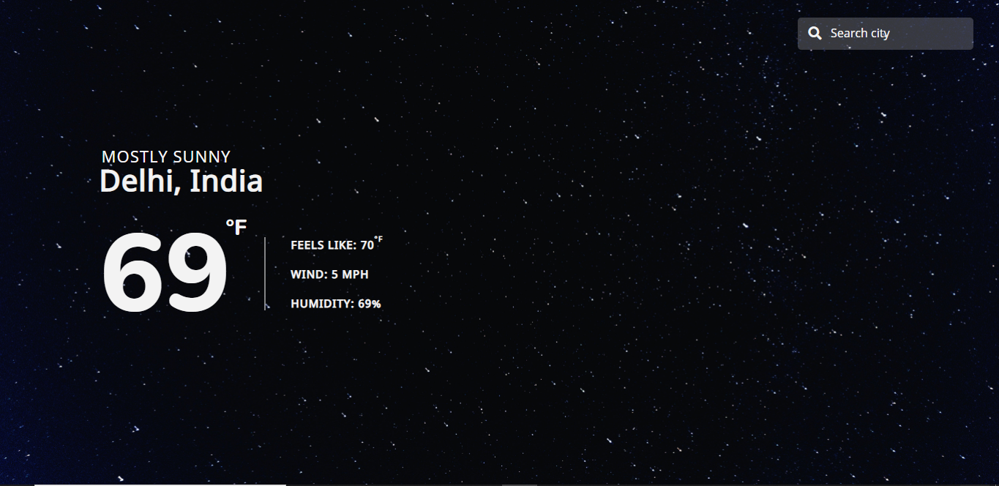

# Weather App

> An app that tells the weather. It comes equipped with an auto-complete search bar to find your city!




## Live Demo

Check out the live demo [here](https://youthful-neumann-3e52e4.netlify.app/).

### Prerequisites
- Install Node JS. ([NodeJS Documentation](https://nodejs.org/en/docs/)) 
- Install Webpack. ([Webpack Documentation](https://webpack.js.org/guides/installation/)) 

### Install
- Clone this repository in your terminal using **git clone** command.
```
    git@github.com:hemant-soni-vst-au4/Restaurant.git
```
- Enter the repo directory.
- Run `npm install && npm run build` in your terminal.

## Author

👤 **Hemant soni**

- Github: [@githubhandle](https://github.com/hemant-soni-vst-au4)
- Twitter: [@twitterhandle](https://twitter.com/abdelperez11)
- Linkedin: [linkedin](https://www.linkedin.com/in/hemant-soni-97427b193/)

## 🤝 Contributing

Contributions, issues and feature requests are welcome!

Feel free to check the [issues page](https://github.com/hemant-soni-vst-au4/weather-app/issues/).

## Show your support

Give a ⭐️ if you like this project!

## Acknowledgments

- Thanks to [OpenWeather](https://openweathermap.org/) for the API 
- Thanks to [Microverse](www.microverse.org) for the opportunity.
- Thanks to [The Odin Project](https://www.theodinproject.com/) for the guidance.

## Future features and improvements

- A better UX and design for the page.
- Instead of a sequential async call stack for `index.js`, implement a timeout-based approach as to not overwhelm the Telepor API with requests when typing a city name.

## 📝 License

This project is [MIT](./LICENSE) licensed.
